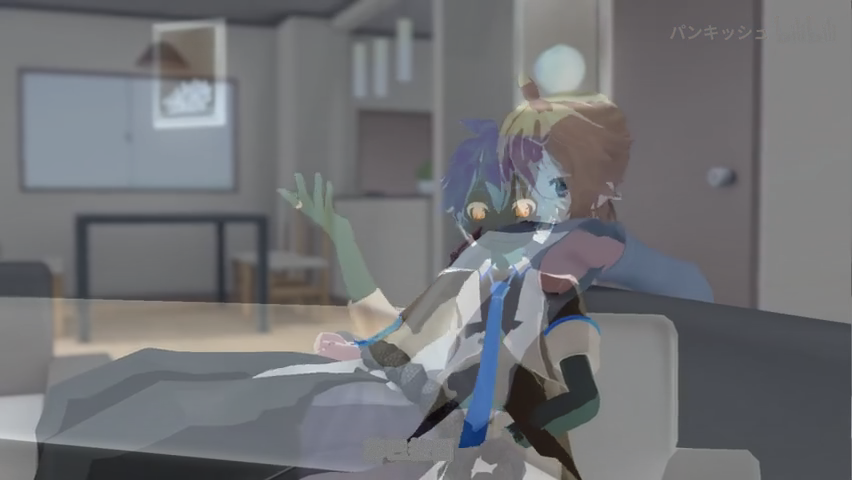
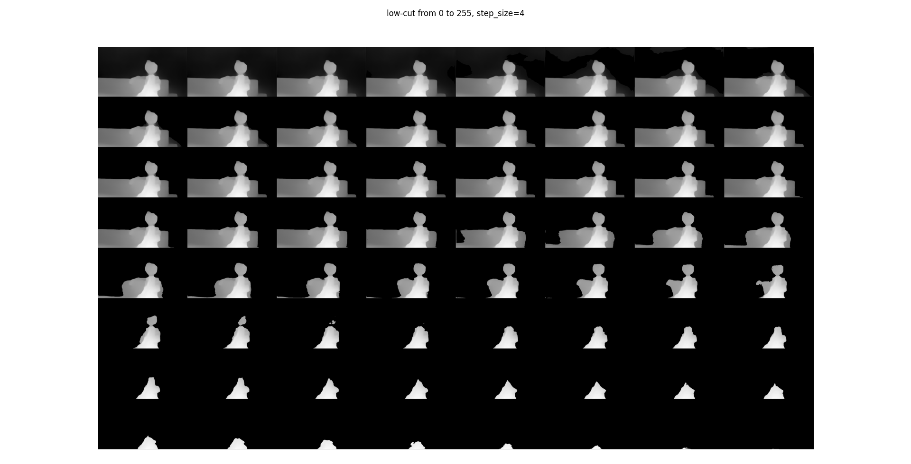
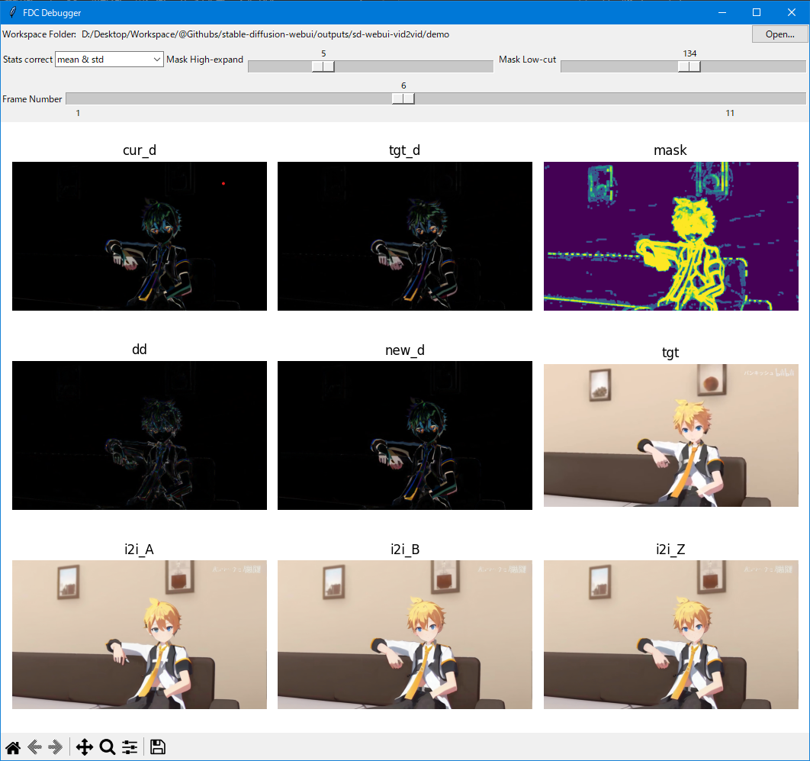
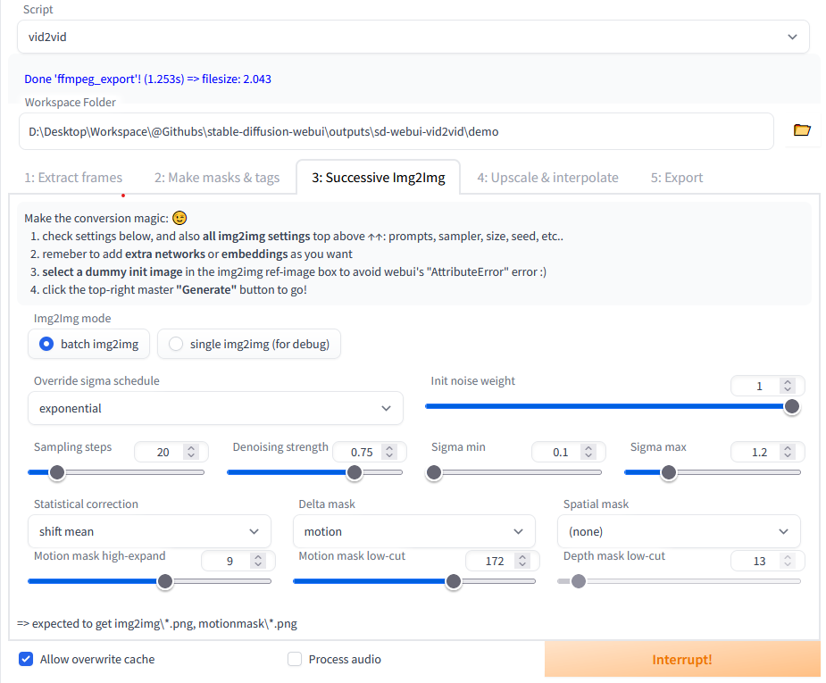

# stable-diffusion-webui-vid2vid

    Translate a video to AI generated video, batch img2img with frame delta correction, extension script for AUTOMATIC1111/stable-diffusion-webui.

----

<p align="left">
  <a href="https://github.com/Kahsolt/stable-diffusion-webui-vid2vid/commits"></a>
  <a href="https://github.com/Kahsolt/stable-diffusion-webui-vid2vid/issues"></a>
  <a href="https://github.com/Kahsolt/stable-diffusion-webui-vid2vid/stargazers"></a>
  <a href="https://github.com/Kahsolt/stable-diffusion-webui-vid2vid/network"></a>
  
  
  <br/>
</p>


Convert a video to an AI generated video through a pipeline of model neural models: Stable-Diffusion, DeepDanbooru, Midas, Real-ESRGAN, RIFE, with tricks of **overrided sigma schedule** and **frame delta correction**.  
Although it sounds like the old joke that an English wizard turns a walnut into another walnut by reciting a tongue-twisting spell. 🤣  

⚠ 我们成立了插件反馈 QQ 群: 616795645 (赤狐屿)，欢迎出建议、意见、报告bug等 (w  
⚠ We have a QQ chat group (616795645) now, any suggestions, discussions and bug reports are highly wellllcome!!  

ℹ This script is only applicable in `img2img` tab :)  
⚠ some tasks will take a real long time, just wait and see the progress bar on console!!


Example: 

| vid2vid | original | img2img |
| :-: | :-: | :-: |
|  |  |  |

demo video original source:

  - title:【LEN/MMD】和风模组面前耍大刀【青月/蓝铁/妖狐】
  - url: [https://www.bilibili.com/video/BV1Vd4y1L7Q9](https://www.bilibili.com/video/BV1Vd4y1L7Q9)
  - uploader: パンキッシュ

settings:

```
Prompts: (masterpiece:1.3), highres, kagamine_len, male_focus, 1boy, solo, indoors, looking_at_viewer, shirt, blurry_foreground, depth_of_field, blonde_hai , black_collar, necktie, short_ponytail, spiked_hair, yellow_necktie, bass_clef, blue_eyes, headphones, white_shirt, sitting, collar, sailor_collar, short_sleeves, upper_body, brown_hair, short_hair, yellow_nails, headset, room
Negative prompt: (((nsfw))), ugly,duplicate,morbid,mutilated,tranny,trans,trannsexual,mutation,deformed,long neck,bad anatomy,bad proportions,extra arms,extra legs, disfigured,more than 2 nipples,malformed,mutated,hermaphrodite,out of frame,extra limbs,missing arms,missing legs,poorly drawn hands,poorty drawn face,mutation,poorly drawn,long body,multiple breasts,cloned face,gross proportions, mutated hands,bad hands,bad feet,long neck,missing limb,malformed limbs,malformed hands,fused fingers,too many fingers,extra fingers,missing fingers,extra digit,fewer digits,mutated hands and fingers,lowres,text,error,cropped,worst quality,low quality,normal quality,jpeg artifacts,signature,watermark,username,blurry,text font ufemale focus, poorly drawn, deformed, poorly drawn face, (extra leg:1.3), (extra fingers:1.2),out of frame

Sampler: Euler
Width: 832
Heigh: 448
Resize mode: Just Resize
CFG Scale: 7
Seed: 114514

Extract FPS: 12
Extract fmt: png
Sampling steps: 20
Denoising strength: 0.75
Init noise weight: 1.0
Sigma method: exponential
Sigma min: 0.1
Sigma max: 1.2
Statis correction: shift std
Delta mask: motion
Spatial mask: none
Motion high-ext: 13
Motion low-cut: 32
Depth low-cut: (not used)
RESR model: animevideov3-x2
RIFE model: rife-v4
Interpolation ratio: 2
Export fmt: webm
```


### How it works?


#### Sigma schedule

Sigma schedule controls the magnitude to denoise a latent image at each sampling step, and it should be an annealing process so that the final painting converges to some local optimal.
This extension allows you to override the default sigma scheduling, now you can fine-tune the annealing process on your own.  

For sigmas tuning reference, see different schedule methods using the helper script [helpers/sigma_schedule.py](helpers/sigma_schedule.py):


parameter tuning guide:

  - initial real sigma numbers for img2img (`~1.0`) are typically smaller than which used in txt2img (`~10.0`), not letting the denoiser to change image content toooo much
  - in old fashion, we would take a long `steps >= 50` with low `denoising strength ~= 0.5` to truncate the tailing part of the whole sigma sequence given by the scheduler, in order to make the annealing steady
  - now with an overrided low initial sigma `sigma max ~= 1.0`, you can take shorter `steps` and higher `denoising strength`
  - for different schedulers, try `linear` and `exponential` first to understand the behaviour! 😀
  - before the real work, the `single img2img (for debug)` mode in tab `3: Successive img2img` is your playground to tune things~

#### Frame delta correction (FDC)

The original batch img2img might still not be that consistent, successive or stable in re-painted details even with fine-tuned sigma schedule. 🤔
We further apply **stats correction & delta mask** using [frame delta](#furthur-things-to-know):  

⚪ stats correction

Stats correction matches the frame delta for generated frames with the references in statistics. 

tuning guide:

  - set to `clip min & max` if the generated images are too different from the references
  - set to `shift std` or `none` otherwise
  - the `mean` related ones will cause global color shift to more dark, do not use!

⚪ delta mask

Delta mask is parallel to the lagacy spacial mask (e.g. alpha-channel, depth-map or just hand-drawn), which masks on the differentials of the two successive images rather than the one image itself. 
You could take either motion or depth as the delta mask. => see [further things](#furthur-things-to-know)

take the motion mask as an example, see the balance between parameter **high-ext** and **low-cut**:

| high-ext \ low-cut | 0 (more area modifiable) | 255 (less area modifiable) |
| :-: | :-: | :-: |
|   1 (area more thin)  |   </br> 残留在镜头玻璃上的边角碎片 |  </br> 和前面所有帧叠加形成重影，趋向于不修改 |
|  15 (area more thick) |  </br> 场景内闪烁的局部细节，趋向于无遮罩 |  </br> 重影但较轻，画面内容稳定 |

tuning guide:

  - set `highext = 15`
  - move `lowcut` from `255` down to `0`, find a point that the ghost shadows disappears
  - move `highext` from `15` down to `1` to allow more painting details to be modified
  - balance `lowcut` and `highext` at some local optimal

and remember the extremes:

  - `highext -> inf & lowcut -> 0`: open to modifications, no re-correction, no restrains, more like naive img2img
  - `highext -> 1 & lowcut -> inf`: conservative to modifications, leading to heavy ghost shadow

#### furthur things to know

what a frame delta look like:

|  |  |
| :-: | :-: |
| frame delta in most static cases is grey | frame delta on scene changing is a ghost shadow mixng two images |

motion mask vs depth mask, the **thing** as a mask:

| type |  <br/> **motion mask** |  <br/> **depth mask** |
| :-: | :-: | :-: |
| highlights area of | varying areas between successive frames, mostly the line edges | foreground object areas in a static sense, usually large patches |
| how to obtain | transformed from the frame delta | predicted by depth-map model MiDaS |

ℹ you could also try use these two masks together~ 😃  
ℹ e.g.: firstly apply depth as spatial mask to filter out the foreground changes, then apply motion as delta mask to decline non-edging changes, keeping large color blocks like cloth texture stable

delta mask vs spatial mask, the **way** to mask on:

| type | delta mask | spatial mask |
| :-: | :-: | :-: |
| masks on | delta of two images | one image |
| apply eqv. | `out = old + (new - old) * mask` | `out = mask * new + (1 - mask) * old` |

use the fdc debugger to further understand tunable FDC parameters:




### Installation

⚪ Auto install

- run `install.cmd`
- if you got any errors like `Access denied.`, try run it again until you see `Done!` without errors 😂

⚪ Maunal install

- install prompt-travel extension
  - `cd <SD>\extensions`
  - `git clone https://github.com/Kahsolt/stable-diffusion-webui-vid2vid.git`
  - `cd stable-diffusion-webui-vid2vid\tools`
  - run `install.cmd` to install the post-processing tools
- install MiDaS
  - `cd <SD>\repositories`
  - `git clone https://github.com/isl-org/MiDaS.git midas`


After installation & webui restart, you should find this control panel in `img2img` tab, under the `Script` dropdown. Now, follow those instruction guide to start! 🧐




#### Acknowledgement

- FFmpeg: [https://ffmpeg.org](https://ffmpeg.org)
- MiDaS: [https://github.com/isl-org/MiDaS](https://github.com/isl-org/MiDaS)
- stable-diffuison-webui: [https://github.com/AUTOMATIC1111/stable-diffusion-webui](https://github.com/AUTOMATIC1111/stable-diffusion-webui)
  - TorchDeepDanbooru: [https://github.com/AUTOMATIC1111/TorchDeepDanbooru](https://github.com/AUTOMATIC1111/TorchDeepDanbooru)
  - depthmap2mask: [https://github.com/Extraltodeus/depthmap2mask](https://github.com/Extraltodeus/depthmap2mask)
  - prompt-travel: [https://github.com/Kahsolt/stable-diffusion-webui-prompt-travel](https://github.com/Kahsolt/stable-diffusion-webui-prompt-travel)
- Real-ESRGAN-ncnn-vulkan: [https://github.com/xinntao/Real-ESRGAN-ncnn-vulkan](https://github.com/xinntao/Real-ESRGAN-ncnn-vulkan)
- rife-ncnn-vulkan: [https://github.com/nihui/rife-ncnn-vulkan](https://github.com/nihui/rife-ncnn-vulkan)

----

by Armit
2023/01/20 
